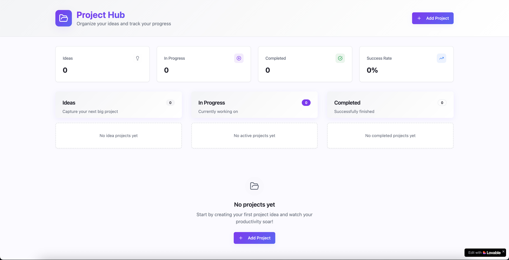
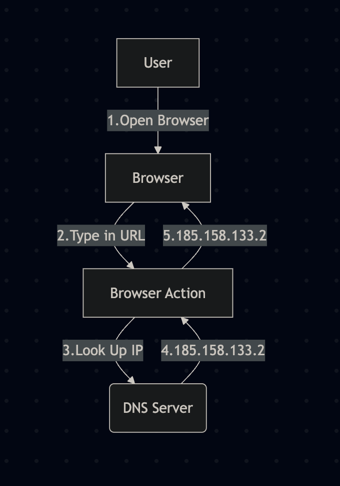
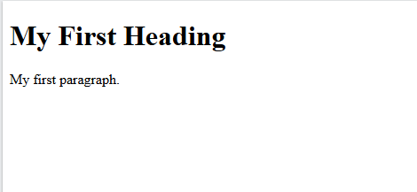
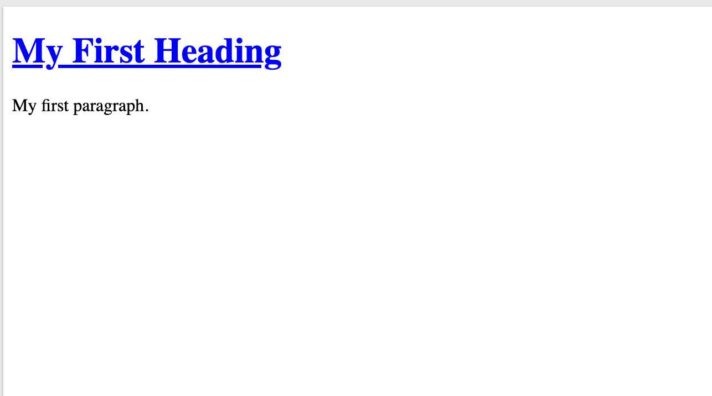
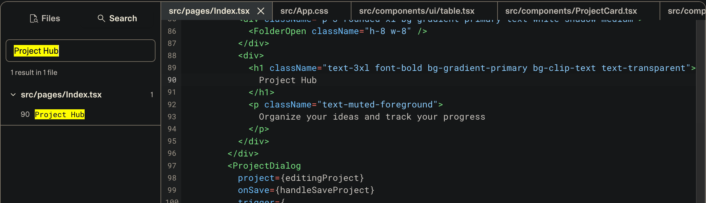
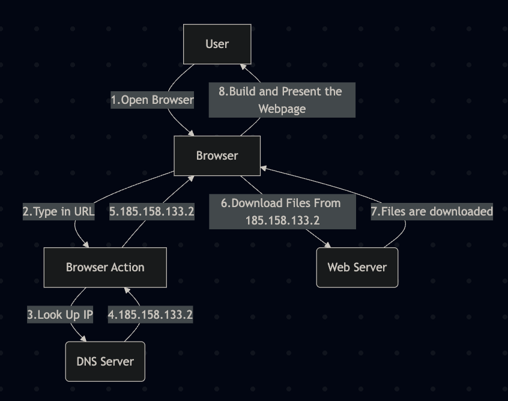

In part 2 of this sequence of posts, I want to really get into explaining what vibe coding platforms like Replit, Lovable and Base44 and many others are really building, and where AI fits into the mix. Once you have a better understanding, you can use external AIs (and save money on the limited credits these services provide you) as well as build and run your code locally, and even deploy it for much cheaper. Even in some cases, for free!

## What really is a web app?
The first thing I want to address is explaining everything that actually goes into a web application generated by vibe coding platforms.

We’re going to do a deep dive, so buckle in!

I’ve whipped up an application in Lovable with the following prompt that we’re going to use as a reference:


`Create a web app that helps organize project ideas and project progress`

And the result:



We’ll start slowly building a diagram as we go, that we can eventually use in future posts.

## Your computer or mobile device
We’re going to start at the part that everyone is familiar with, the device used to actually view the web application.

We’ll start with a very baseline understanding of what “data” is.

Pretty much everyone is familiar with files on your computer. Any time we talk about data, just imagine a file filled with 1s and 0s instead of text. And whenever we talk about a transfer, think about a file going to or from a flash drive (which I feel like most have used at one point or another).

Alright, here we go (and I promise, everything here is true and accurate but just may be super-simplified)!

That Lovable application I whipped up as a demo, we’re going to use that as our example web application.

We’ll begin by typing in our demo URL into our browser bar:

https://project-flame-forge.lovable.app

But how does this set of words and symbols get us to a website?

First, it’s turned into an IP address. There are tons of companies all over that operate what’s called a DNS Server short for “Domain Name Server”. A URL you type into your address bar is actually called a domain. This DNS Server is literally an address book of name to IP address mappings. So when you type in a URL, your computer sends a lookup request to a DNS Server and gets back an IP. You can do this yourself (and I recommend it, just to help cement the idea) by going to a site like:

https://www.nslookup.io/

and typing in a URL.

Go ahead, try it! Put “google.com” or “project-flame-forge.lovable.app”!

You’ll see a set of IP addresses, basically a list of numbers separated by dots. Like these:

- 185.158.133.1

- 185.158.133.2

This is basically an address straight to a server. Behind that server is a complicated web of OTHER servers, but we’ll simplify past that. The same way you went to that website and retrieved IP addresses from a website name, is what your browser does!

Now that your web browser has the actual server location, it’ll make a request for the webpage data. The same way you would drag-and-drop files off of a flash drive, but the server is the flash drive and your browser is your computer (it’s actually VERY similar).

Here’s the big secret to how websites actually work; You just download all of the “code”, images and content to your computer! Then once all of the files are in a neat little folder, deep on your hard drive, your web browser loads them up. This is why you can operate a website when you lose internet (except for things that reach back out to the internet). At least until you refresh the page, and try to redownload it all again!

Here’s a diagram of what we’ve talked about so far:




## Ok so files on my computer
Right, so now your web browser has downloaded all of the files that make up the website, and it’s sitting on your computer in a crazy-named folder.

As you’ve seen while using the internet, the website loads in pieces. That’s each file getting successfully downloaded and loaded by the browser, then rendered.

So we’re going to go through what makes up a website next, and it tends to be three types of files.

## The bones of the webpage - HTML (Hyper-Text Markup Language)
While it might seem like developers hold all of their knowledge in their heads when writing out code, that couldn’t be further from the case.

Everything you see here, and practically every piece of code you see generated, has documentation available online for it that developers reference.

Here’s an example reference document for HTML, what we’re about to discuss: https://www.w3schools.com/TAGS/default.asp

While more commonly used components of programming are memorized, everything else is a simple internet search away.

Now, onto HTML!

The older readers might remember HTML from school, or from Myspace, but we’ll go over the basics here.

HTML defines the general structure of a webpage. It’s defined as a series of hierarchical tags, and the web browser understands and renders these tags. With only HTML, web pages look very very basic and boring, like in the following example:

```html
<!DOCTYPE html>
<html>
<body>

<h1>My First Heading</h1>
<p>My first paragraph.</p>

</body>
</html>
```
This renders in the browser as



HTML like a persons skeleton, or the frame of a house, or a car! However, HTML isn’t really a programming language. It’s part of a characterization of code called a mark-up language. You’re not doing any calculations or dynamically changing things with HTML, just laying out the bones!

Everything is done with an open bracket <Open> and ends in a closed bracket </Open> where the / after the first < denotes an end. You can also shorthand this with <Open/>.

This is important, since you can always copy and paste some HTML out of one LLM project and post it in another to request changes, allowing you to spread those credits and save a little money!

Most vibe-coding and code generation tools will write code that will generate HTML, but sometimes it’ll create the HTML directly. We’ll get into that later!

For now, we’ll figure out the next piece of the puzzle, the Styling.

## The styling of the webpage - CSS (Cascading Style Sheets)
For example, we’re about to do a quick look at CSS. While CSS isn’t really a language, it’s not exactly mark-up like HTML.

CSS is like the skin color, hair color and clothing color of a person. Or to use a less weird example, the siding color of a house or a car.

It doesn’t define how anything is laid out, but it changes it’s properties for how it looks.

So, if we wanted to take the earlier example and change the header to be more interesting, it might look something like this:

```html
<!DOCTYPE html>
<html>
<head>
<title>Page Title</title>
</head>
<body>

# This is the updated line
<h1 style="color: blue; text-decoration: underline">My First Heading</h1>
<p>My first paragraph.</p>

</body>
</html>
```

This renders out like so:



You can see if you compare the HTML with our HTML + CSS example that we simply added an attribute called `style` to the HTML h1 tag (which stands for header 1). In that header, we used CSS syntax to define a color, and define a text-decoration, specifically “underline”.

It’s really as easy as that. However, there’s an elephant in the room to address about CSS.

A lot of things in software are hierarchical, or additive.

Rather than every developer simply write CSS, open source developers created abstractions on top of it, and with all things in technology, there’s dozens of options to choose from. However, as someone vibe-coding an application, you don’t particularly care about the specific technology being used, just how to utilize it.

### Example 1
Lets take a look at our sample application and get a brief reminder of what it looks like:


Lets say we want to change the name of our application. We only have a very basic knowledge of HTML and CSS per this post, so lets see what we can do.

Lets say we want to change the name or properties of the title, “Project Hub”.

Through lovable, we can do a search through the code for that text and see what we find:



It can be daunting seeing hundreds of lines of code, but slowing down and thinking critically about everything on the screen is all that’s needed to be productive!

So, we see in the file “index.ts”, on line 90 is the text Project Hub. We navigate over to the code, and we can see on the highlighted line that the text is present.

We see that Project Hub is between an `<h1>` and `</h1>` HTML tag, which we know means it’s specific HTML tag, but “className” is new. That’s one of those higher level CSS abstractions, but the good news is, we don’t care!

We have a few options here, we can either A. Try to edit the HTML/CSS ourselves (if we pay for that tier), B. Copy and paste the code into a different generative AI and ask it to make changes, or C. Ask (in this case) Lovable to make the change for us.

For now, to avoid increasing the scope of this post too much, we’re going to move on to…

### The functionality of the webpage - JavaScript

JavaScript is what makes the web run. It’s the actual coding language being used by browsers to DO stuff on a page.

When your application runs a filter? Creates a new item in a list? Makes an API call to Spotify? All of that is being done with JavaScript.

I’m going to keep JavaScript fairly light, because editing JavaScript does actually require some coding knowledge and it’s best to rely on the LLM to make JavaScript updates for you.

I’ll expand on that in future posts, but now we’ll review what it means to be…

## “Serving” a web app

Ok so we have a very basic understanding HTML/CSS/JavaScript as concepts.

We talked about the browser downloading the files onto your computer, and we have a general idea of what those files are comprised of. Here’s a diagram of where we are so far!



So how exactly does Lovable turn a set of AI generated files into something that can be downloaded to your machine?

If you read my first post in the series, you know that what these platforms like Lovable, Base44 and Replit primarily offer a walled-garden place to run your auto-generated code, since that can be nearly as hard as coding it in the first place!

The way they do this, is by bundling up the files into something can be hosted by a web server. Think of this as having a bundle of files on your computer and zipping them up into a single .zip file. That zip file can be unraveled by the tool’s server so that when it’s accessed by a browser, everything is provided in the right way.

This requires running many servers, especially if the vibe-coding platform offers “backend” services.

So far, all I’ve really written about in this series is the “frontend”. This is code that executes in your browser after being downloaded. But as mentioned in Part 1, this is only 33% of what goes into a web application.

Many of these tools use an abstraction for browser development called React. My next post in this series is going to be how to decipher and edit React code as a vibe-coder, without having any true software development knowledge!

---

PS. I use https://mermaid.live to create diagrams, here’s what I used to build the latest diagram from above:

```
flowchart TD
U[User] --> |1.Open Browser|Z
Z[Browser] --> |2.Type in URL|A
A --> |5.185.158.133.2|Z
A[Browser Action] -->|3.Look Up IP| B(DNS Server)
B --> |4.185.158.133.2|A
Z --> |6.Download Files From 185.158.133.2| C(Web Server)
C --> |7.Files are downloaded|Z
Z --> |8.Build and Present the Webpage| U
```