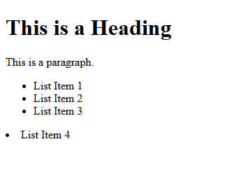
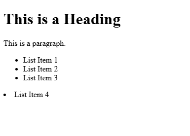
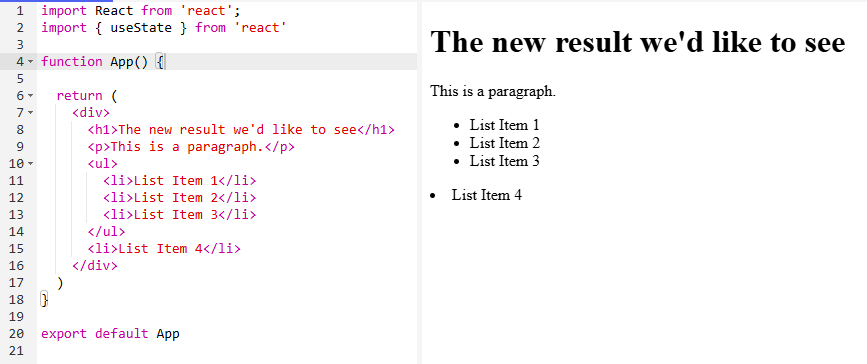
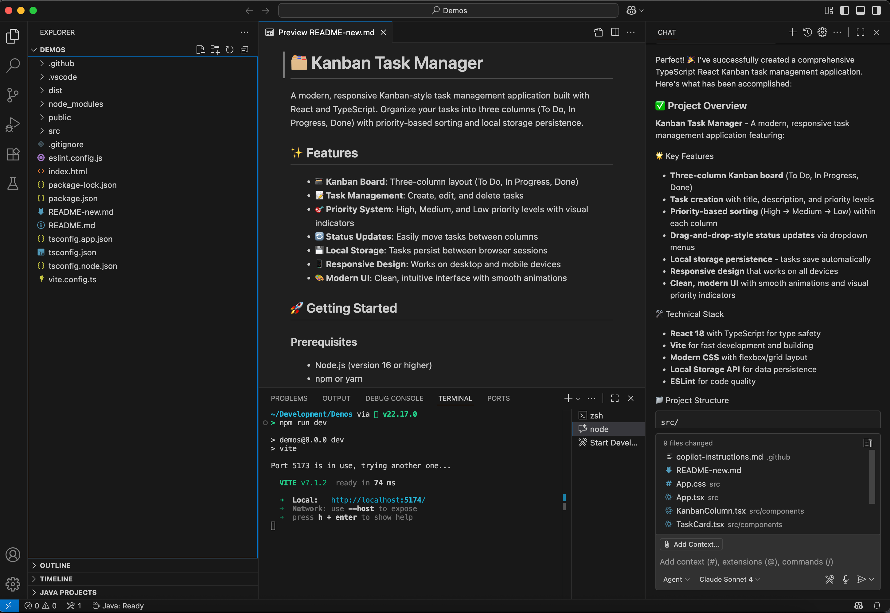
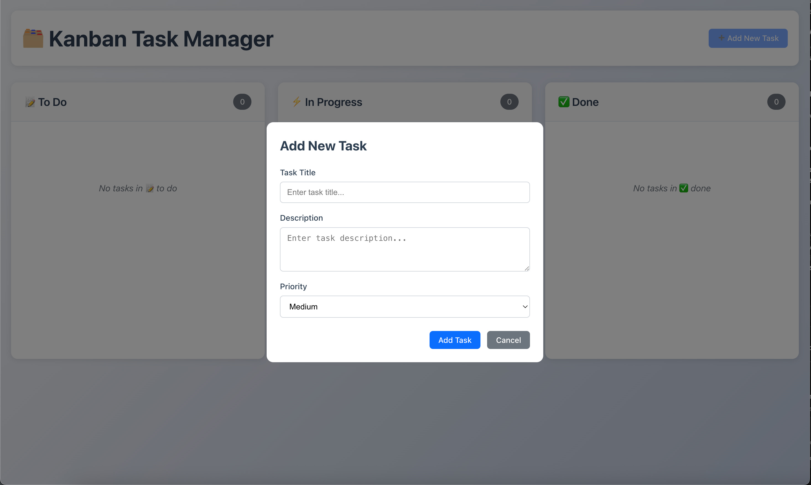
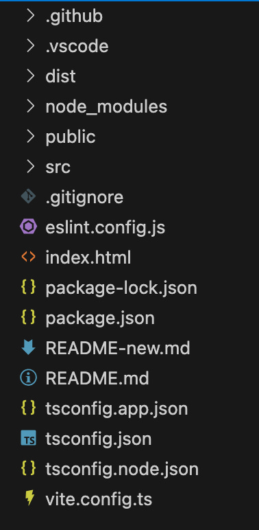
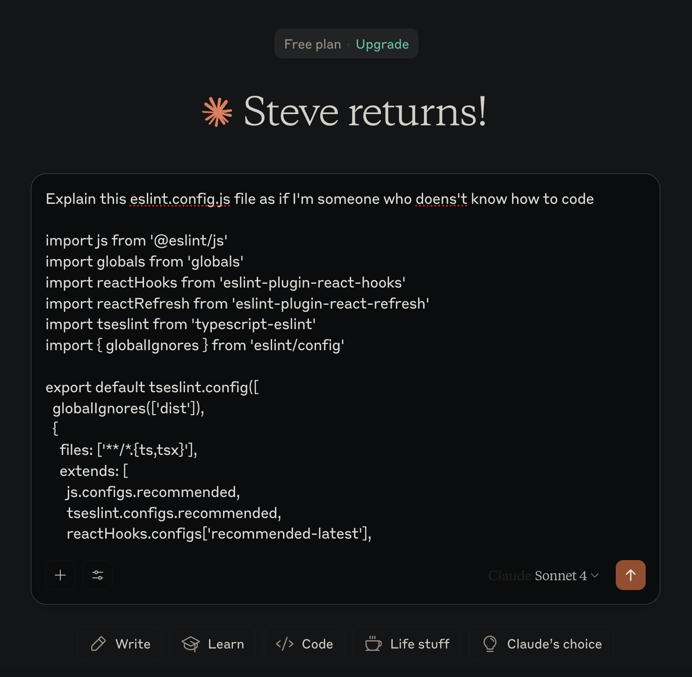
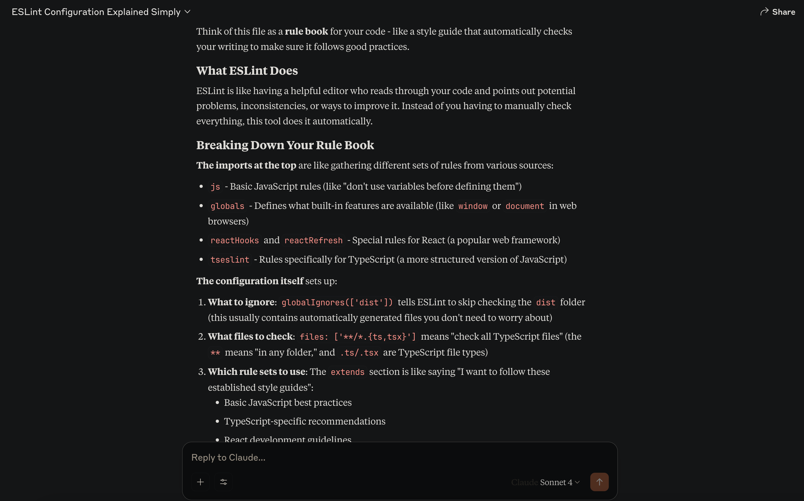
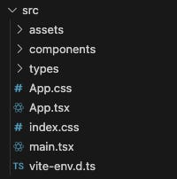

In this part of the series, I want to start to really dig into how someone with no development experience can review, understand and even edit the code that’s generated by AI project generation tools, specifically when they generate React code.

The last post went over the basics of web applications, specifically a high level overview of HyperText Markup Language (HTML), Cascading Style Sheets (CSS) and JavaScript (JS). These project generation AI platforms don’t usually provide ONLY these basic building blocks of the internet, but instead a higher level abstraction.

This is to the advantage of vibe coders and real developers everywhere, as it’s easy to build and design with higher abstractions.

I want to help give you, the reader, as much confidence as possible to start wading into the code your AI chats and platforms are creating, to make simple edits and changes. As time goes on, you’ll get more and more comfortable touching the code and asking more developer-like questions in your prompts, resulting in a much higher quality product! (And maybe, trying out regular ole development, augmented with AI)

## What IS React?
To understand React, we first need to define what a programming library is. In software development, a library is a collection of pre-written, reusable code that developers can incorporate into their own projects.

A useful analogy is a set of specialized tools. If you are building a house, you wouldn't forge your own hammer or manufacture your own saw. You would use reliable, pre-made tools to perform specific tasks efficiently. Similarly, instead of writing code from the ground up for common tasks like handling dates or creating complex animations, a developer can use a library that has already solved that problem. This practice saves significant time and reduces the potential for errors.

React is a popular and powerful JavaScript library. Its purpose is to facilitate the creation of user interfaces (UIs)—the parts of an application that users see and interact with. It provides the foundational blocks for building modern, responsive web applications.

React was developed at Facebook (now Meta) to address a specific and persistent engineering challenge. Around 2011, Facebook's web application was growing in complexity. Features like the chat and notification systems were difficult to manage, often resulting in bugs where the user interface would not correctly display the underlying data. For example, a notification badge might show unread messages even after they had been viewed, creating a poor user experience.

An engineer at Facebook, Jordan Walke, proposed an innovative solution. The conventional approach was to track changes in data and manually write code to update the corresponding parts of the UI. Walke’s approach was to have the application automatically re-render entire sections of the UI whenever the underlying data changed.

This may sound inefficient, but it was made possible by a key innovation: the Virtual DOM. The process works as follows, with an analogy following after:

1. React maintains a lightweight representation of the actual page structure (the DOM, or Document Object Model) in memory. This is the "Virtual DOM." Basically a copy of the data used by the execution.

2. When data changes, React creates a new Virtual DOM reflecting the updated state. Practically the same as having two text files, and updating just one of them.

3. React then compares this new Virtual DOM with the previous one, identifying the precise differences between them. This comparison process is known as "diffing."

4. Finally, React updates only the specific elements on the actual page that have changed, rather than reloading the entire page.

Put into non-technical terms, this would be like a filing cabinet full of all of your tax returns, bills and other documents. Then, you have a tablet with an inventory of everything in your filing cabinet.

When you want to add something to the cabinet, or maybe remove or update something, you make the change first on your tablet.

From there, you have an employee that goes and manually does the work in the filing cabinet itself, using your tablet data as reference. This seems like it might be more work, but imagine your employee is REALLY good at going through this filing cabinet, and you are not. You can make efficient changes on a machine with lots of bells and whistles, maybe a search box. And the employee knows exactly where to go in the filing cabinet to do the task at hand. It’s a lot faster! (Ignoring the fact that YOU could just get better at knowing the filing cabinet, because that breaks the analogy).

This method proved to be remarkably efficient and made UI development far more predictable and manageable. Facebook open-sourced React in 2013, and it was quickly adopted by the development community. Its focus on a component-based architecture—building UIs from isolated, reusable pieces—has had a profound influence on how modern web applications are built.

I personally believe this component architecture has made it extremely easy for AI tooling and platforms to build React, as the same repeated patterns are utilized and there are hundreds of thousands, if not millions of examples that have been consumed and are ready to pluck from the LLMs memory.

## How can I read React without knowing JavaScript
In the previous post, we look at HTML and CSS, and reviewed a very short example.

Here’s a short HTML example from the last post:

```html
<!DOCTYPE html>
<html>
<body>

<h1>This is a Heading</h1>
<p>This is a paragraph.</p>
<ul>
  <li>List Item 1</li>
  <li>List Item 2</li>
  <li>List Item 3</li>
</ul>

<li>List Item 4</li>

</body>
</html>
```
Which results in the following webpage!



We can look at the HTML and the image to see a few things:

- h1 - This tag seems to make big, bold letters. It stands for Heading-1, the largest HTML page heading size (there is heading 1-6 by default)

- p - A paragraph, just some simple text showing up on the screen

- ul - An unordered list, this is a wrapper that contains other elements. The same way other tags have content between the <> and </> tags

- li - List Item, this makes up each of the items in the list. Three of our list items are inside a <ul> tag, so they are indented as part of a specific list. Our fourth list item is outside of the <ul> tag, so it sits on the far left hand side of the page

Lets look at the SAME code in React and see what type of abstraction we’ll be working with:

```html
import React from 'react';
import { useState } from 'react'

function App() {

return (
    <div>
        <h1>This is a Heading</h1>
        <p>This is a paragraph.</p>
        <ul>
            <li>List Item 1</li>
            <li>List Item 2</li>
            <li>List Item 3</li>
        </ul>
        <li>List Item 4</li>
    </div>
)
}

export default App
```

And our output:



### That’s just the same stuff, but with more stuff
Good observation!

Since we’re approaching this from the perspective of a non-developer, reviewing both chunks of code DOES look extremely similar.

The main differences are that the code from the first example is now wrapped in a `return ( )`, AND a <div>. <div> is shorthand for “division” or a sectioned off bit of HTML. We’ll get further into that later. But for now, we can still ignore the fluff above and below our HTML, and just look at our text.

If we want to update the Heading, in both examples we see where we can simply backspace `This is a Heading` and replace it with the new result we’d like to see!



Now, this isn’t a very normal React example. The part of the code you see on line 4, “function App()” is creating a component called <App>. This means that our entire webpage is in a single component.

That’s not what a developer would want, and it’s not what an LLM or a web app AI platform would create either!

Now this is a very simple example, we’ll look at a more complicated web-app example soon and how without even knowing regular development, you’ll be able to make changes or targeted prompt requests!

For now, here’s a more React-ey approach:

```html
import React from 'react';
import { useState } from 'react'

function App() {

const Header = () => {
    return <div>
      <h1>The new result we'd like to see</h1>
    </div>
    }
    
    const TextAndList = () => {
    return <div>
      <p>This is a paragraph.</p>
      <ul>
        <li>List Item 1</li>
        <li>List Item 2</li>
        <li>List Item 3</li>
      </ul>
    </div>
    }
    
    return (
    <div>
      <Header/>
      <TextAndList/>
      <li>List Item 4</li>
    </div>
    )
}

export default App
```

In this example, you can see the “const” sections have a name (Heading and TextAndList), and then a section of code.

But now, down at the bottom of the example, instead of using bare HTML tags we are using the names next to the “const” sections defined above. This is how we can build components, and these components can be across different files as well.

We’ll unpack this further with a larger example, showing how you can find and edit your react application, without really deeply understanding the code!

This code in react is called JSX.

JSX is a syntax extension for JavaScript. In plain English, that means you can write HTML-like code **directly inside your JavaScript file**.

This is a game-changer because it lets you mix your layout (the HTML) with your logic (the JavaScript) in the same place. Instead of two separate files trying to communicate, everything is bundled together. This makes it super easy to create dynamic, interactive components.

## Editing A React Project
We’re finally getting to the meat of this series of posts, what the heck ARE all of these files?

In this section, I’ll go over a project I created in Copilot and what *exactly* was created, and what it’s purpose is. I’ll try to provide context as to what is relevant to you, the reader, what might be relevant to your standard software developer, and what nobody should be changing often, if ever.

Once Copilot loaded up, I provided it the following prompt:

```
Create a typescript react project that allows users to input and prioritize tasks in a kanban style.
Now, I buried the lede a little bit by pre-specifying a few pieces of technology and design, but these are the typical ones used by vibe-coding platforms like Replit and Lovable.
```

We talked about React and we’ll talk a little bit about TypeScript later.

But back to Copilot…

Here’s our project that Copilot whipped up in about 5 minutes of frenzied code generation:



Lets go over the files and folders in the base folder, categorized by NEVER OPEN and WILL BE EDITING. First, here’s our application:



Completely generated by Copilot.



Here’s a quick overview of each file and folder in our root folder:

(a foreward, folders and files that start with a period (. or dot) are typically used for configuration and are meant to be hidden from more normal tools. For example, in Windows, dot folders are hidden by default from regular users.)

### NEVER TOUCH

- **.github** → This folder is used by Github tooling, and probably not by your project. For example, if you used Github to deploy your application, you might have a workflow file in here that Github uses to deploy the code. This folder can usually be ignored entirely. This folder may or may not be in your project, since it’ll usually only get autogenerated if Github is relevant to your AI. It certainly is for Copilot, so it provided me one. Since we’re not going to be manually editing Github workflows, we have no need to open this folder.

- **.vscode** → Similar to .github, this folder contains content specifically related to Visual Studio Code (the editor I happen to be using). This folder may or may not be in your project, based on the tool you are using. This is managed automatically by the tool, so we have no need to open this folder.

- **dist** → The dist folder is SUPER important. This is where your build project is after being built (and sometimes when you are testing it). This folder will contain the RAW files that will be given to a user’s web browser to display it. The code present in this folder might be harder to read and useless to modify, since it’s created by our source code. We have no need to open this folder really ever!

- **node_modules** → This folder might be HUGE. In my project, most of the files are in the tens to hundreds of bytes, maybe even a few hundred kilobytes. This folder is 106 megabytes! (for reference, just in case, 1 megabyte = 1,000 kilobytes = 1,000,000 bytes).

- **eslint.config.js** → Ok this one is a doozy, so we’ve talked about JavaScript right. Well JavaScript has this other version called ECMAScript. Linting is the action of (in this context) checking that code is formatted properly. So this is the ECMAScript Linting Configuration File that basically just enforces formatting. We’ll pretty much NEVER come into this file, if the AI creates it, whatever it sets is probably more than good enough.

- **index.html** → This file acts as the base point of the application. It basically creates an initial block and says “this is called app”. React sets up it’s base application level component and builds everything inside of it. We need a constant, default spot for everything to start up, and that’s this file! It’s very simple, and we very rarely will need to go into it to make changes.

- **package-lock.json** → This file is a snapshot in time of the package.json. For example, the package.json might specify any version above version 1 of a library. When you execute your code, you’ll want it to be the same every time. So even though version 2 of that library gets released, you’ll want your project to re-use verison 1. That’s what the package-lock.json file does, locks the versions of your dependencies. We’ll never touch this file.

- **package.json** → This file contains the definition of the project and it’s dependencies. This can include anything from scripts that will run or build your project, to which libraries are pulled in. The name and identifier of the project are here, along with any additional configurations. We likely won’t look in this file often, but expect the AI to make many changes here.

- **tsconfig.json/tsconfig.app.json/tsconfig.node.json** → This configuration file tells our application how to convert our TypeScript into JavaScript. I’ll mention this more later in the post, but for now we know that we will NOT be touching these files.

- **vite.config.ts** → Finally, this is the main configuration file for our project that uses Vite. This is basically the control panel for the project, executing all of the processes that need to run for testing, building and executing the application. We probably will NEVER open this file.

WILL BE EDITING
- **public** → This folder is served at the root of our project when it’s deployed out to the world. What that means, is that if we want to provide an image for our webpage, we’ll probably put it in this folder. Inside our code, we’ll reference /public/<myImageFile>.jpg to point to the file. The AI will probably place some files in here, but if we want to replace one of the AIs files, this is where we’d likely override it.

- **src** → This folder is the MOST important to us, since this is where all of the code that makes up the project lives. We’re almost always going to be doing things (and the AI will for that matter) in the src folder. It’s the “source” of our files project.

- **.gitignore** → When our project is published to a git repository system like Github, this file contains all of the files that are to be ignored. We’ll edit this file (or the AI will) when we need to have files on our development machine, but not on a remote server. For example, the node_modules folder from before that’s hundreds of megabytes of downloaded code. We can always just redownload that stuff later, so there’s no need to upload it to the code repository.

- **README.md/README-new.md** → MD is short for Markdown, which is basically just a way of formatting text so that it renders in a specific format. For example, if you do # Title vs ### Title, #Title is the largest heading available, while ###Title is much smaller. Software projects tend to have the concept of a single centralized README file that describes everything you’d need to run the application. Feel free to request from the AI things like “put an explanation of the project in the README” or “add an explanation where to change style in the README”. Most tools will whip up a README with a decent amount of information anyway.

And remember, you can always paste the contents of a file into any AI and get pretty good result of what it means. For example (please ignore the typo):





Next, lets dive into the `src` folder:



- assets → This folder contains all of the assets used by the code. This might include .svg files or images that aren’t sitting in the public folder

- components → This is where the meat of the project lives, our actual components!

- types → This is a byproduct of TypeScript, something that I’ll mention later on in this post. We don’t especially need to care about this file, but it’s useful for development.

- App.css → Previous posts talked about CSS. This is almost like the index.html file, but for CSS. It’s a root CSS that will define very broad styles about the webpage. Because this is so important to the base page, we probably won’t be making many changes in here. Style changes are fairly easy to make when we have an ok understanding of CSS. Let’s interrupt the file explanations and look at an example:

If we review this file, we see the following:


We can experiment and see what this controls, even without really understanding CSS. Lets change background from “white” to “green” and see how our webpage changes after we hit save (while running the application locally using instructions from the README):


Pretty simple right? The CSS component is called “.app-header” and has a property called “background” that said “white”. We changed it to “green” and the app header’s background turned green!

If we look over the file further, we see “.app-header h1”. I mentioned `h1` earlier in this post, and in an earlier post. It’s short for heading. So I think we can assume that the following CSS controls the heading for the page, and we know it’s a header inside .app-header, because .app-header is before h1.


Lets change this color to “white”.

And just like that, without any prompting and just some simple discovery and experimenting, we’ve completely changed the color palette of our application.


One of the major take-aways from this post isn’t that you need to become a developer to build products like this, but instead treat the AI as a partner that’s helping you learn AND doing tasks for you. Where you can, you should try to absorb some developer skills, if not only because it will allow you to supercharge your prompts with additional context!

Alright, back to the explanations!

App.tsx → This is the execution code version of the App.css. This file contains the entry point to our application, but at the React level. Where index.html was our foundation, these are our walls. Is unlikely to be changed by us.

index.css → Lots of repeating here, but this is the .css file that pairs with the index.html. Used as a foundational file, with all other files extending from it. Unlikely we will want to make changes here.

main.tsx → This is our root tsx file, it also acts as an entrypoint, but if the App.tsx is the foundation, this is the actual property it rests upon. We probably won’t change this file at all.

vite-env.d.ts → This file contains environment configurations for Vite. This should be auto-setup by your project-creating LLM, so not likely something we’re going to edit.

Next, we’ll dig into the `components` folder to really get into the meat of the code


We’ll open KanbanColumn.tsx. We should always look at where it says `return (` near the bottom of the file usually, since that’s what defines the actual component.


Now, if we review this code without any deep coding knowledge, we can gather a lot of contextual information.

Just like before, we see all of the className fields that we could put in the search and find the associated CSS file, but we also see `<TaskCard` amidst all of the code in there. This maps to the TaskCard.tsx file, lets open that up!

We won’t delve too much more into the code here, but we can give an example of something we find in TaskCard.tsx:


Even though we don’t know how this “getPriorityColor” might be used code-wise, we can tell that it’s determining the colors, so that’s easy to change.

Using Search is a Superpower
Every editor and tool that allows you to edit code (for the most part) has a search function. While it can seem like searching for a needle in a haystack, utilizing the search is invaluable for devs and non-devs alike to find what they are looking for quickly. Nobody keeps an entire application in their mind. Even the most seasoned developers are using the search all of the time to find where they need to be.

We can use our earlier example to change the content in our header. Here’s a refresher:


We’ve changed the color, but what if we want to change text on the page. Rather than ask an AI and potentially cause weird issues elsewhere in our application, we can just use the search!

Strings of text especially are simply laid out in the code, so lets search for “Welcome to your Kanban Board!”


And there it is! Let’s open that file and see what it looks like.


I know this can be daunting because it’s straight into the project source code, but we’re going to use context clues and the search to supercharge our capabilities.

Firstly, lets change that text!


We hit save, and just like magic:


Our text at the bottom now matches our new code.

But how can we use the search to continue to enable ourselves… well we see the wrapper around the message says `className=”welcome-message”`.

Lets toss that in the search and see what comes up:


We see the welcome message on line 129 in the search, under App.tsx which is the file we’re currently in. But we also see it directs us EXACTLY to the relevant CSS for this. We have “.welcome-message {“, “.welcome-message h2 {“ and “.welcome-message p {“.

If we look back at our main code, that maps to the open tags we have under the welcome-message div. So we now know where we can go to change the style of the <h2> tag and the <p>.

This is how breaking things into smaller component pieces can make development and vibe-coding significantly easier, and thankfully AI does a good job following best practices.

You barely even have to know anything about the project to make styling changes throughout it. But you might be thinking, “this is still pretty complicated looking, how do I know where to actually look besides searching for text”.

I’m glad you asked! The next section is about…

How to Inspect
Browsers have a development mode that is super useful for figuring out stuff like “where is the code for this component”. Lets do a quick example:

Say we want to remove the text on this button:


We search for “Add a task please” and find the following:


Then we delete the text and leave only the + emoji:


But now we’ve lost our place in the code, how do we find out where the code is for this button?

We use Chrome devtools!

We’ll start by right-clicking the button and pressing inspect:


This will open up a bunch of tools, but what we care about is the “Elements” tab here:


From here, we get a LOT of context about where we can go to find our button. The clicked element should be highlighted, and the code won’t be identical to our React code, since this is straight HTML/CSS/JS instead of React, but the beauty of JSX is that a lot of it is still HTML and CSS.

We can put nearly anything here into the search and find out button. Lets put the button class in, “btn btn-primary btn-large”.


Just like that, we’re right back where we wanted to be!

TypeScript and TSX
Everything up until this point has been about JavaScript and JSX using React. But many of these code generation tools will use the latest and (by my opinion) one of the greatest changes to JavaScript, JSX and React; Typescript and TSX.

Keeping this very high level, consider the following example:

5 + 2 = 7
a = 5
a + 2 = 7
c = a + 2
c + 3 = 10
It reads like a little math puzzle, but it’s really showing the basics of “variables”. A variable is simply a name for a piece of data (at least for our current context).

In the example, a gets set to 5, then c gets set to 5 + 2, and then c is 7.

ANYWAY, variables and coding aren’t that important here, what’s important is describing what Typescript and TSX actually are.

So in the example above, everything we see are numbers, operators (like + and =) and variables.

These variables in JavaScript are simply containers for data, a literal variable.

However, in typescript we are doing JavaScript, with types! A type is simply a label that’s important to the programming language.

So if we redo that example in typescript, it’d look like this:

As someone vibe-coding this application, you probably won’t need to think too deeply about types, since it’s at the individual line level and most of what we’ve addressed is simple text manipulation.

Summary
Over this series, we’ve gone over the basics of what makes up a web page and some technical background around components relevant to a web application.

This post is the first to really get into the weeds with how to actually DO new things in your project without a coding background.

The next few posts are going to build on this, and introduce software development concepts but in a friendly, less-technical way that’s easy to digest and doesn’t require months of learning how to code. The goal isn’t to become senior developers here, it’s to help enable you to rely on the AI agent less, to save credits for the larger and more important changes.

Next Post
The next two posts will go over two common and required concepts when implementing a web application that LLM implementations tend to ignore, and will include example prompts on how to validate the AI isn’t building a time bomb just out of view!

Those posts are

Pagination for Vibe-Coders

Caching for Vibe-Coders
    