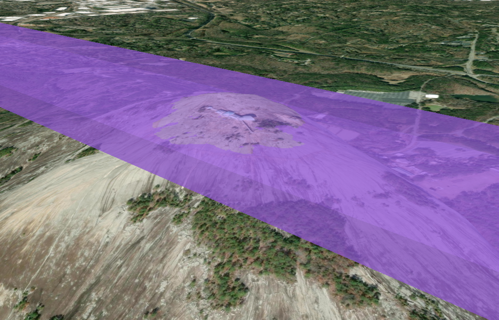
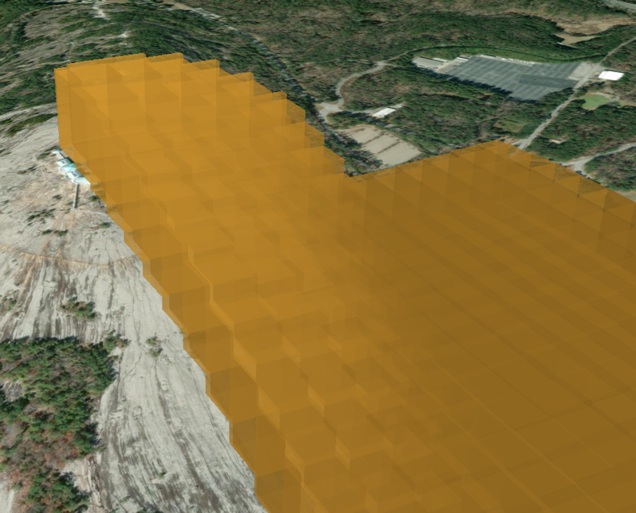
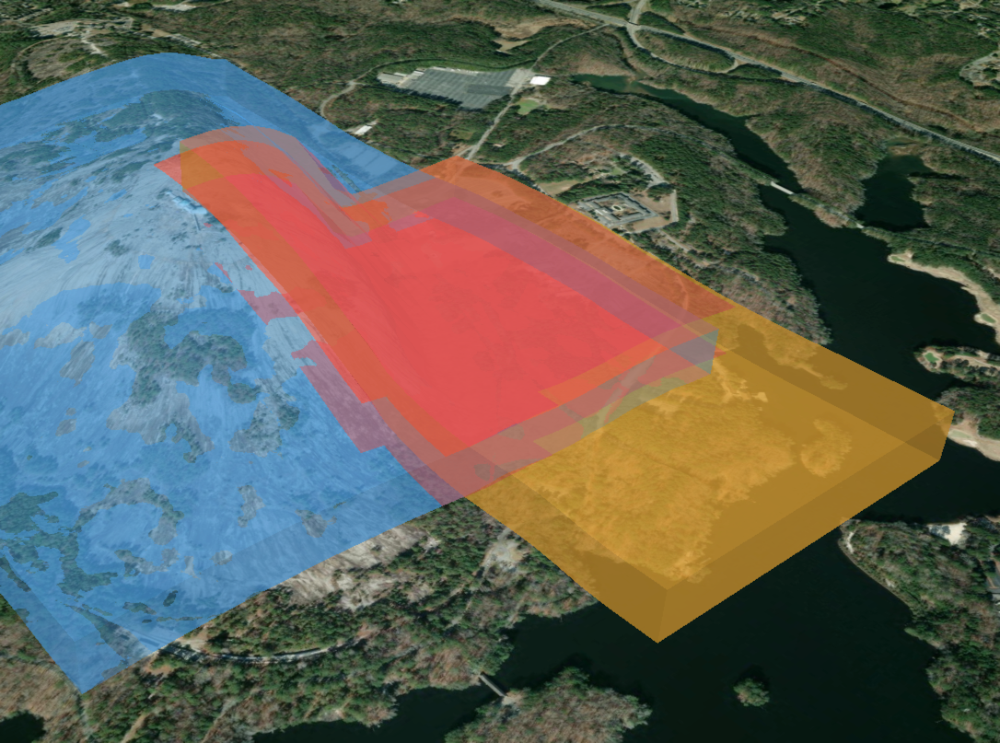

## Table of Contents

[[toc]]

# Brief

In a previous project, I modeled 3D airspace volumes the way most 2D GIS systems do it: store the footprint as a polygon, sample the terrain **once** at the polygon's centroid, and turn the whole airspace into a flat slab with a static top and bottom. It works well enough over flat ground, and it falls apart quietly and completely the moment real terrain gets involved.

This post is about what's actually wrong with that model, and about the replacement I built to test: tessellating the footprint into small cells, resolving Above Ground Level (AGL) altitudes against terrain _per cell_, and storing each cell as a true 3D solid in PostGIS. The result is a terrain-following airspace volume that you can index, render, and — with one neat trick — run conflict detection against thousands of other volumes in under a second.

Everything here is backed by a working demo project with Docker Compose, SQL, terrain loading scripts, benchmarks, and a CesiumJS viewer, built over real elevation data around Stone Mountain, Georgia. The full source is in [this GitHub repo][demo-repo].

# The Centroid Slab Problem

First, the model being replaced. AGL airspace means the floor and ceiling are defined relative to the ground beneath them — "surface to 100m AGL" is a volume that should hug the terrain. The conventional 2D-GIS-with-altitude-columns approach handles this in three steps:

1. Store the airspace as a 2D polygon with `lower_agl` and `upper_agl` values
2. Sample terrain **once** at the polygon's center point, converting the airspace into a flat slab: `[center_ground + lower_agl, center_ground + upper_agl]`
3. Check conflicts with a 2D footprint intersection AND a flat altitude interval overlap

The entire 3D problem gets reduced to one terrain sample and two numbers. Over flat ground, that's fine. Put the same airspace over a mountain and you get three distinct failure categories:

**False negatives on real conflicts.** Two volumes that genuinely overlap in the real world can report no conflict, because each one's flat altitude interval was computed from a different centroid on different terrain. The centroid model silently approves intruders flying through transit layers.

**Volumes that fail to contain their own traffic.** An airspace defined as "surface to 100m AGL" might float 247 meters above the actual ground at the edges of its footprint. An aircraft legitimately operating at 50m AGL near that edge is _outside_ the volume that was created to contain it.

**Volumes that extend underground.** On a slope, the slab's ceiling can fall below the ground surface. Altitude checks in those regions are meaningless.

These failures scale directly with terrain relief, and they're unstable — a small adjustment to the footprint moves the centroid, which moves the single terrain sample, which can flip a conflict verdict without changing what the airspace means in the real world.



# The Fix: Tessellated Terrain-Following Volumes

The core idea fits in one sentence: **split the footprint into small cells, resolve AGL against the terrain per cell instead of once, and store each cell as a true 3D solid.**

Each cell becomes a vertical prism — a flat polygon at its own `bottom_z`, extruded up to its own `top_z`, both computed from the ground elevation _inside that cell_. The union of prisms approximates the actual curved airspace volume, and the approximation error is bounded by how much the terrain varies within a single cell. Smaller cells, smaller error, and you get to pick the tradeoff.



## What You Need

Four things, and the last one matters more than it looks:

- **PostGIS with the SFCGAL extension** (`postgis_sfcgal`). Core PostGIS is mostly 2D/2.5D; SFCGAL provides the real 3D machinery — polyhedral surfaces, SOLIDs, `ST_3DIntersects`, `ST_Extrude`, `ST_MakeSolid`, and `ST_Volume`. The demo repo has a Docker Compose file with a PostGIS 16 + SFCGAL image ready to go.
- **A queryable terrain model.** Point samples in a table with a spatial index, raster data, any DEM source — the tessellation logic doesn't care, as long as it can ask "what's the ground elevation here?"
- **A projected coordinate reference system.** The demo uses EPSG:32616 (UTM zone 16N) so that distances are in meters and volumes are in cubic meters. Doing this math in degrees is a bad time.
- **One consistent height datum, everywhere.** The demo uses WGS84 ellipsoidal meters throughout; if your terrain data is orthometric (heights above the geoid, which is what "elevation" usually means colloquially), convert it explicitly with a documented geoid offset.

That last point deserves its own sentence: **never mix height datums.** Ellipsoidal and orthometric heights differ by roughly 30 meters in many places, and mixing them creates silent ~30-meter vertical errors — which is exactly the class of bug the centroid slab model introduces constantly. The whole point of this exercise is to stop lying about the vertical axis.

## The Tessellation Process

The demo wraps tessellation in a single function, `build_airspace_cells(cell_size_m)`, which does the following for each airspace:

```
1. Grid the footprint using origin-anchored squares
   (identical footprints produce byte-identical cells)

2. Clip each square to the footprint
   (edge cells become partial polygons)

3. Compute per-cell ground elevation
   (average of DEM samples inside the cell)

4. Determine vertical bounds:
   AGL:  bottom = ground + lower_agl, top = ground + upper_agl
   MSL:  bottom = greatest(lower_msl_converted, ground),
         top = upper_msl_converted

5. Extrude the flat cell into a closed 3D solid
```

Step 5 is where SFCGAL earns its keep. Each cell becomes a solid with one expression:

```sql
ST_MakeSolid(
  ST_Extrude(
    ST_Force3D(cell_geom, bottom_z),
    0, 0, top_z - bottom_z
  )
)
```

`ST_Force3D` places the flat cell polygon at its bottom elevation, `ST_Extrude` pulls it straight up into a closed polyhedral surface, and `ST_MakeSolid` tags that surface as a SOLID so SFCGAL's 3D predicates treat it as a filled volume rather than an empty shell. Each row in the resulting `airspace_cells` table is one vertical prism.

Two design details in step 1 and step 3 are easy to overlook and pay for themselves later:

**Grid anchoring.** The grid is anchored to the coordinate system's origin, not to the footprint. That means two airspaces with identical footprints — say, a low sector ALPHA from surface to 100m AGL and a high sector BRAVO from 100m to 200m AGL stacked on top of it — get _byte-identical_ cell geometries. No floating-point slivers between them.

**Shared ground sampling.** Because stacked airspaces share identical cells, each pair of stacked cells also gets the identical per-cell ground elevation. So `ALPHA.top_z = BRAVO.bottom_z` holds _exactly_, cell by cell, across arbitrarily rough terrain. Stacked airspaces stay perfectly stacked. This becomes important in a minute, because "touching" versus "overlapping" is the crux of conflict detection semantics.

Cost-wise, tessellation is a build step, not a query step. On the demo hardware, tessellating the test airspaces takes about 3.5 seconds for ~3,100 cells at 50-meter resolution and ~7.5 seconds for ~11,900 cells at 25-meter resolution — and you only re-tessellate when an airspace or the DEM changes.

## Indexing in Three Dimensions

A regular GiST index on geometry only indexes X and Y. For 3D solids you want the n-dimensional operator class:

```sql
CREATE INDEX ON airspace_cells USING gist (solid gist_geometry_ops_nd);
```

This indexes the 3D bounding box of each solid — X, Y, _and_ Z — and enables the `&&&` operator (the 3D cousin of `&&`) for indexed 3D bounding-box overlap tests. It turns "compare every cell against every cell" into "compare each cell against the cells whose 3D boxes actually touch it," which is the difference between a usable system and a quadratic one.

# Conflict Detection: Three Approaches

Now the payoff. Given thousands of prisms across many airspaces, which airspaces actually share volume? I tested three approaches in the demo, and the progression is instructive.

## Attempt 1: ST_3DIntersects

The obvious first move:

```sql
SELECT ...
FROM airspace_cells ca
JOIN airspace_cells cb
  ON ca.airspace_id < cb.airspace_id
 AND ca.solid &&& cb.solid
 AND ST_3DIntersects(ca.solid, cb.solid);
```

This runs in well under a second at every resolution I tested. There's just one problem: **"intersects" includes touching.** A well-designed airspace system is _full_ of deliberate touching — stacked layers sharing a ceiling/floor face, adjacent sectors sharing a wall. Remember all that work to make `ALPHA.top_z` exactly equal `BRAVO.bottom_z`? `ST_3DIntersects` dutifully reports every one of those shared faces as an intersection.

At 25-meter resolution, this query returns **48,620** candidate pairs — of which only **3,599** actually share volume. Useful as a candidate filter; unreliable as a verdict.

## Attempt 2: Exact CSG Confirmation

The geometrically correct answer is to compute the true boolean intersection and measure it:

```sql
... AND ST_Volume(ST_3DIntersection(ca.solid, cb.solid)) > 0.001
```

`ST_3DIntersection` uses SFCGAL's exact arithmetic; the volume is zero for touching solids and positive for real overlap. This is correct for arbitrary solids — and it costs **37–48 milliseconds per candidate pair**. Multiply by 48,620 candidates at 25-meter resolution and one full conflict sweep extrapolates to roughly **39 minutes**. Correct, and unusable as the hot path.

## Attempt 3: The Prism Shortcut (Use This One)

Here's the observation that makes the whole architecture work. Every tessellated cell is a _vertical prism_: constant 2D cross-section, flat top, flat bottom. For that shape — and only that shape — the 3D intersection problem decomposes:

> Two prisms share volume **if and only if** their 2D footprints overlap with positive area AND their z-intervals overlap with positive length. And the shared volume is exactly `overlap_area × z_overlap`.

No 3D CSG required. The whole conflict sweep becomes 2D area math plus interval arithmetic on columns you already have:

```sql
SELECT ca.airspace_id, cb.airspace_id, ca.cell_id, cb.cell_id,
       ST_Area(ST_Intersection(ca.cell_utm, cb.cell_utm))
         * (least(ca.top_z, cb.top_z) - greatest(ca.bottom_z, cb.bottom_z))
         AS volume_m3
FROM airspace_cells ca
JOIN airspace_cells cb
  ON ca.airspace_id < cb.airspace_id
 AND ca.solid &&& cb.solid
 AND least(ca.top_z, cb.top_z) > greatest(ca.bottom_z, cb.bottom_z)
 AND ST_Relate(ca.cell_utm, cb.cell_utm, '2********');
```

Every clause is doing a specific job:

- **`ca.solid &&& cb.solid`** — the indexed 3D bounding-box prefilter. The join never goes quadratic.
- **`least(top) > greatest(bottom)`** — strict inequality on the z-interval overlap. Ceilings meeting floors (stacked airspaces) produce equality, not `>`, so touching is excluded from conflicts by a single comparison. This is the stacked-airspace semantics problem solved in one line.
- **`ST_Relate(..., '2**\*\*****')`** — requires the 2D *interiors* to share area (that leading `2` in the DE-9IM pattern means a 2-dimensional interior intersection). Cells that share only an edge or a corner don't count.
- **The volume expression** — plain arithmetic on table values. No CSG anywhere in the hot path.

I cross-validated the prism math against the exact CSG method: the volumes agree to the third decimal place. This isn't an approximation of the CSG answer — for prisms, it's the _same_ answer computed intelligently.

## The Numbers

| Cell Size | Cells  | Candidate Pairs | Prism Sweep | True Conflicts | CSG Estimate |
| --------- | ------ | --------------- | ----------- | -------------- | ------------ |
| 100 m     | 839    | 3,238           | 0.05 s      | 278            | ~120 s       |
| 50 m      | 3,106  | 12,485          | 0.20 s      | 974            | ~523 s       |
| 25 m      | 11,859 | 48,620          | 0.87 s      | 3,599          | ~2,330 s     |

The prism sweep is roughly **2,600× faster** than CSG, and the speedup came from a WHERE clause, not from new infrastructure.

One more property worth calling out: **convergence.** Total conflicting volume across resolutions goes 89.74M → 89.52M → 89.45M m³ from 100m down to 25m cells — a 0.3% spread, with _identical yes/no verdicts at every resolution_. Finer tessellation sharpens the boundary precision; it doesn't change decisions. Which means you can run interactive checks at coarse resolution and refine offline, and trust both.

)

## So Why Keep the Solids at All?

If the prism columns (`cell_utm`, `bottom_z`, `top_z`) answer conflict queries, why store SFCGAL solids? Four reasons:

1. **Rendering** — the solids export cleanly to a 3D viewer (the demo ships a CesiumJS app that renders them directly).
2. **Point-in-airspace queries** — `ST_3DIntersects(solid, point)` just works.
3. **Volume measurement** — `ST_Volume` for reporting and analytics.
4. **Non-prism geometry** — climb corridors, sloped approach surfaces, and noise-abatement cones aren't prisms. Those pairs fall back to real CSG.

The architecture keeps the solids as ground truth and uses prism math as the fast path for the overwhelmingly common prism-vs-prism case. Exotic shapes stay correct; they're just not free.

# Migrating an Existing Centroid-Based System

If you're running the centroid-slab model today, the migration is more incremental than it looks. Six steps:

**Step 1 — Keep your definitions.** Your existing airspace definitions — `footprint + lower + upper + altitude_ref` — remain the source of truth. Nothing about them changes. The only thing being replaced is the _derived_ centroid slab.

**Step 2 — Stand up a terrain source.** Deploy a DEM covering your operating area (point table or raster, either works) in a single declared vertical datum. Record your geoid offsets and make every conversion explicit — the demo wraps this in a `geoid_offset_m()` function so nothing converts silently.

**Step 3 — Add the tessellation infrastructure.** Create the `airspace_cells` table and the `build_airspace_cells` procedure, then backfill by tessellating every existing airspace. Pick cell size from your terrain, not from a default: the rule is that ground variation _within one cell_ should stay below your vertical safety margins. Flat plains tolerate 200-meter cells; mountainous terrain demands 50 meters or less.

**Step 4 — Rewrite conflict detection.** Implement the prism-shortcut query pattern: indexed `&&&` prefilter, strict z-interval overlap, `ST_Relate` interior test. Wire your "airspace changed" events to re-tessellate that one airspace and run a scoped conflict check against the rest.

**Step 5 — Regression test, and expect disagreements.** Run the new system alongside the legacy one. They _will_ disagree — that's the point. Every disagreement is one of the failure classes from the top of this post: a missed conflict, a phantom conflict, or a volume that didn't contain its own traffic. Audit them systematically with visual rendering plus database inspection, and each one becomes evidence for the migration rather than a bug in it.

**Step 6 — Fix altitude checking while you're in there.** "Is this aircraft inside this airspace?" becomes: position (lon, lat, alt) is inside if it falls within some cell's 2D footprint with `bottom_z ≤ alt ≤ top_z`. One indexed lookup, resolved against the terrain _beneath the aircraft_ instead of beneath a centroid that might be kilometers away.

Operationally, the costs are comfortable: re-tessellating a single airspace takes sub-second to a few seconds, and a scoped conflict check against thousands of existing cells runs in milliseconds. Both fit inside a write transaction or an async validation workflow.

# Limitations Worth Knowing

No model is free, and this one has four honest caveats:

**Stair-stepping.** Flat per-cell floors approximate a smooth surface with steps proportional to terrain slope × cell size. Unlike the centroid model's unbounded, accidental error, this error is bounded and chosen: halving the cell size halves the error, at roughly 4× the cell count.

**Geoid handling.** A constant geoid offset is fine for areas up to roughly 10 kilometers across. Beyond that, evaluate a real geoid grid (PROJ + EGM2008) per terrain point at load time.

**DEM consistency.** The conflict math only requires the DEM to be internally consistent. But if you render against a viewer's own terrain (Cesium World Terrain, ESRI World Elevation), expect several meters of visual offset unless you sample the renderer's terrain — the math is right even when the picture looks slightly off.

**Non-prism geometry.** Sloped surfaces and cones fall back to CSG. Keep them rare, or pre-tessellate them into prism approximations.

# Wrapping Up

The centroid slab model isn't a simplification of AGL airspace — over real terrain, it's a different (and wrong) airspace entirely, and it fails in ways that don't announce themselves. Tessellation replaces one unbounded, invisible error with a bounded, chosen one, and the prism structure of the resulting cells means correctness doesn't cost you query performance: the exact conflict answer drops out of 2D area math and an interval comparison, about 2,600× faster than the general 3D approach.

If you want to poke at it yourself, the [demo repo][demo-repo] has the full pipeline — Docker Compose with PostGIS + SFCGAL, terrain loading for Stone Mountain, the tessellation SQL, the benchmark scripts behind the table above, and a CesiumJS viewer to see the volumes in 3D. The repo's `HOW_IT_WORKS.md` goes one level deeper on the math and migration details than this post does.

[demo-repo]: https://github.com/StevenPG/DemosAndArticleContent/tree/main/blog/postgis-airspace-tessellation
